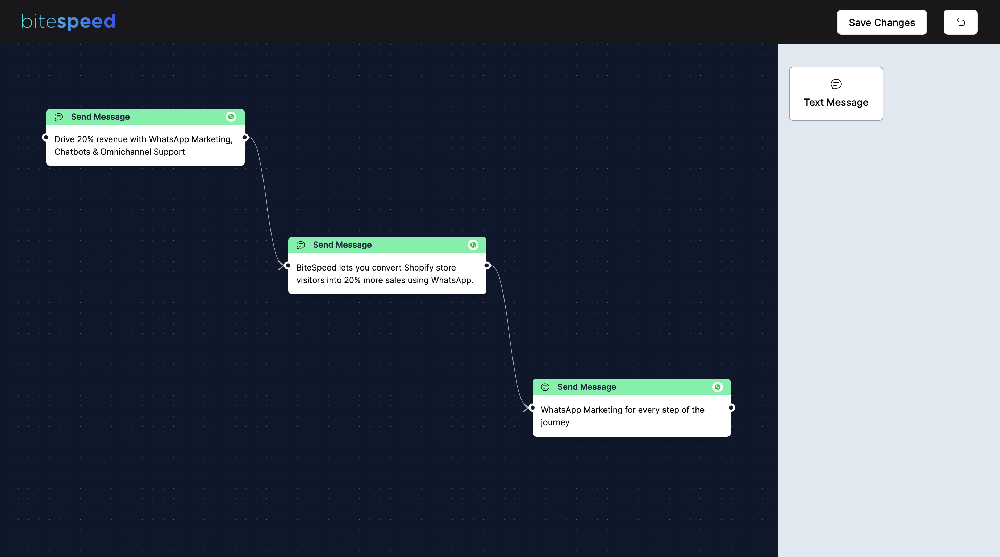

# Front-end Test for BiteSpeed

Front-end assignment for Bitespeed.
Developed with Next.js. Components from shadcn/ui.

[Live on Vercel](https://chatbot-flow-eta.vercel.app/chatbot-flow)

---



---
### 💡 Running Locally

```bash
$ git clone git@github.com:Vynex/chatbot-flow.git

$ cd chatbot-flow
$ npm install

$ npm run dev
```